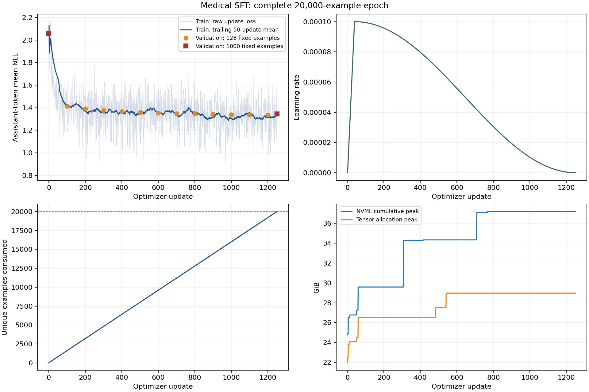

# Stage 1 — Medical SFT 实验报告

验收结论：**DONE**。全局[verifier收据](../../experiments/stage1/verification-final.json)为PASS，10个gate全部通过；[31项仓库测试](../../experiments/stage1/tests-final.json)和[100条raw生成重算](../../experiments/stage1/generation_audit.json)也通过。正式共同初始化及其只读文件hash见[initialization manifest](../../experiments/stage1/initialization_manifest.json)。

正式 run `s1_formal_20260908T152119_60040b` 已实际完成20,000个唯一训练样本的一完整epoch，覆盖率100%，共1250次有效批次更新。本报告依据完整训练、独立重载、1,000条验证和配对生成产物编写；阶段最终状态与全局收据以 `project_state.json` 和 `experiments/stage1/verification-final.json` 为准。Stage 2–6本轮未执行。

本阶段建立可恢复的医疗SFT初始化，并测量输出格式与长度。没有运行CMExam/CMB test评分，没有证明临床正确性、考试准确率提升或后续Dynamic Sampling收益。

## 1. 数据源与来源固定

Medical-o1选择中文医疗文件 `medical_o1_sft_Chinese.json`，保留原始Complex_CoT和Response；Huatuo选择固定GPT4-SFT文件，保留原回答，不生成额外CoT。原始数量分别20,171和142,248；实际Huatuo全部为单轮human/gpt对。两个来源分别提供推理风格与开放医疗问答风格，20k是已冻结的初始化预算；这不是经过规模消融得到的最优数量。

| source | revision | raw SHA256 |
| --- | --- | --- |
| medical_o1 | fc2c9e8a37b38f38da6d449564a8c350b244aef4 | e64b1426723b63899287236d20e9bbaec9f185e1ce4b24e9b61f610facb4369a |
| huatuo | 4077ffaeb123e49b8b8a0283f42957a5570a52ce | 8fbd78692ea9b80727c9e94bfd0eaacc283fe03fdec8e7730bdb2bc550a975be |
| cmb_test | 935fbc09edf1303d89872b21265ff597f426ac0d | 99e6e858dd1955fe2b27fd1da75a7be8fbf6d27059fdb8cf61bc28383a68129c |
| cmexam_train | fadb22c89beb1b7115dc36460ba792eb96b7b972 | 3d6ca5e2499c510956534740c95179c483d9d47d2531e39fc5069333ffd23724 |
| cmexam_val | fadb22c89beb1b7115dc36460ba792eb96b7b972 | 58cc9776b2f17fdc3a235ceec9ae153ee3f617703293dda661c6decbffb1f190 |
| cmexam_test | fadb22c89beb1b7115dc36460ba792eb96b7b972 | e998f69b3f8108bf08bcb8cc9a2a6ed276afeabde6ba3caa3015789b1f6fd407 |

完整文件URL、bytes与SHA见 [raw manifest](../../experiments/stage1/s1_data_20260908T144854_bac3a7/raw_manifest.json)。固定上游metadata将Qwen和两种SFT源标为Apache-2.0，先前审计见 [upstream findings](../implementation/UPSTREAM_FINDINGS.md)；CMExam仍按研究用途处理。原始数据/权重只留bulk，Git保留索引、哈希和少量案例。

## 2. 清洗、去重与隔离

先投影CMExam train54497、val6811、test6811以及CMB-Exam test11200，共79,319条question-only exclusion。测试答案和difficulty不进入投影、训练或调参；只做预先文本隔离，不根据测试表现调整阈值，也不删除测试题。这里“没有使用test调参”不等于“从未下载带其他列的原始CSV”：下载保留原始字节，解析只读取指定题干字段。

结构清洗检查实际schema/role、空值、编码异常、明显非医疗文本、极端重复及控制标记。规范化采用NFKC、小写、空白/标点/前导题号处理，保留数字、小数、符号、单位与否定；只有题干后存在多个明确选项标记才剥离选项。精确question hash后，以完整char3 Jaccard>=0.65检索候选，char5 Jaccard>=0.85或SequenceMatcher>=0.90确认近重复。后者只在char3候选边界内适用。含benchmark的整个连通簇中的SFT成员均排除，包括传递关系。

| source | raw | 编码 | 重复文本质量过滤 | benchmark簇排除 | SFT簇去重 | clean unique | train | val |
| --- | --- | --- | --- | --- | --- | --- | --- | --- |
| medical_o1 | 20171 | 1 | 0 | 485 | 3039 | 16646 | 10000 | 500 |
| huatuo | 142248 | 9 | 14 | 4 | 4851 | 137370 | 10000 | 500 |

完整图有10,803条exact、2,990条SequenceMatcher、696条char5确认边。源内边与跨benchmark边均保留；medical-o1与Huatuo直接边实际为0，不能凭空声称两种SFT源之间移除了近重复。489条benchmark关联SFT记录是簇成员数，不是直接边数。原拒绝记录保留；补充 `rejections_resolved.jsonl` 用真实相邻边给出分数，明确相邻边目标和最终cluster代表可能不同。

规范化曾错误把“A、B两种药物”视为选项，导致首个治理run失败；修复发生在数据冻结前。官方CMExam train另有两条纯标点题干，保留ID和异常记录，没有可用词法匹配信息，未用答案修复。保守相似度还会把数字不同的高度相近题型归为同族，例如85%/95%的边界；这有误排风险。词法隔离不是语义改写零泄漏的证明。

## 3. 固定划分与token统计

SFT簇代表优先较小的medical-o1源，同源按seed42哈希确定；在clean代表上使用独立seed42 split哈希排序，每源前500为val、随后10000为train。没有复制、重复采样或降低过滤规则凑配额。训练与验证ID/cluster互斥，并与exclusion簇隔离。原始到messages、native模板、input IDs和labels在独立核验中对全部21,000条重新计算。

| source | token范围 | total | mean | P50 | P90 | P95 | P99 | max |
| --- | --- | --- | --- | --- | --- | --- | --- | --- |
| all | total_tokens | 9,168,530 | 458.43 | 432.50 | 673.00 | 741.00 | 870.00 | 1558 |
| all | supervised_tokens | 7,741,165 | 387.06 | 346.00 | 594.00 | 658.00 | 781.01 | 1265 |
| all | reasoning_tokens | 3,160,870 | 158.04 | 48.50 | 375.00 | 414.00 | 506.00 | 868 |
| all | answer_tokens | 4,359,460 | 217.97 | 231.00 | 318.00 | 341.00 | 392.01 | 588 |
| medical_o1 | total_tokens | 5,669,839 | 566.98 | 554.00 | 735.00 | 790.00 | 899.00 | 1356 |
| medical_o1 | supervised_tokens | 4,947,754 | 494.78 | 480.50 | 658.00 | 715.00 | 830.01 | 1265 |
| medical_o1 | reasoning_tokens | 3,160,870 | 316.09 | 307.00 | 414.00 | 454.00 | 540.00 | 868 |
| medical_o1 | answer_tokens | 1,676,032 | 167.60 | 149.00 | 283.00 | 321.00 | 379.00 | 567 |
| huatuo | total_tokens | 3,498,691 | 349.87 | 334.00 | 455.00 | 514.00 | 681.04 | 1558 |
| huatuo | supervised_tokens | 2,793,411 | 279.34 | 278.00 | 342.00 | 363.00 | 412.00 | 599 |
| huatuo | reasoning_tokens | 0 | 0.00 | 0.00 | 0.00 | 0.00 | 0.00 | 0 |
| huatuo | answer_tokens | 2,683,428 | 268.34 | 267.00 | 331.00 | 352.00 | 401.00 | 588 |

验证集另有456,624 total /385,092 supervised tokens。长度统计覆盖选中train/val及选择时实际扫描的21k候选，没有把它冒充全142k源数据的分布。所有选中样本最长1558，低于2048，因此无截断、无超长替补。源诊断另外发现未选中Huatuo记录长2477/2200/2101，说明直接硬截断确有丢掉最终回答的风险；策略是整例拒绝并同源补足。

medical-o1平均总长566.98、reasoning316.09，reasoning P95=454/P99=540/max868；Huatuo平均总长349.87、reasoning恒0。两源各10k并不等于token loss权重一半一半：medical-o1占监督token的63.91%。不能由此进一步声称梯度范数贡献等于该百分比。

## 4. 输出格式与label mask

实际Qwen tokenizer的 `apply_chat_template(enable_thinking=True)` 负责role边界；不手写替代ChatML。medical-o1 target为原CoT置于`<think>...</think>`，原Response置于`<answer>...</answer>`；Huatuo保留空think与原回答。未使用其他模型编推理。

system/user/header的labels为-100，实际assistant内容及EOS参与loss，padding按有效长度mask；PAD与EOS即使同ID也不误删真实EOS。多轮fixture验证Qwen native模板会去掉历史assistant的think块、保留历史answer/EOS；实际训练数据为单轮，不能报告成多轮CoT训练。Transformers5.5.3返回类型通过显式`return_dict=False`固定。

完整data verifier重算21k原生编码与监督位置；CPU梯度oracle比较microbatch1/2/4与整批token-mean loss及更新。正式不packing，保留明确样本边界、coverage和EOS追踪。

## 5. 模型、LoRA与正式配置

主干为官方`Qwen/Qwen3-8B`，revision `b968826d9c46dd6066d109eabc6255188de91218`，BF16，未量化。它是已经后训练的混合thinking模型，不是`Qwen3-8B-Base`预训练权重；本文“Base”仅指加入本项目医疗adapter之前的同一官方checkpoint。选择它沿用固定研究主干，未做Instruct/Base消融。

LoRA r32、alpha64、dropout0，覆盖q/k/v/o/gate/up/down七种projection，共87,293,952个FP32可训练参数；base权重保持BF16。早期alpha32规划明确在D-017改选64，与已验证的PEFT架构一致；没有证据证明64优于32。后续Vanilla/Dynamic必须从同一最终SFT adapter和同构设置初始化。

AdamW LR1e-4，betas0.9/0.999、eps1e-8、weight decay0；cosine，warmup3%（38个计划更新），grad clip1，seed42。microbatch4×accumulation4，有效16；仅固定16条内部按长度排序以减少padding。目标函数是整批有效assistant token的平均NLL，gradient checkpointing开启，SDPA，max sequence2048，packing=false，`PYTORCH_ALLOC_CONF=expandable_segments:True`。

正式由fresh base +新LoRA/optimizer启动，不延续smoke/pilot。全部源文件/config/data哈希在clean commit `f591a9e968f9c0c4fc80e54c8cd793a9ff6c8148` 冻结，训练中未改超参或数据。第一更新LR=0是原生warmup行为，其样本/前后向照实记录；非零adapter变化由全程digest与独立logits证据证明。完成条件是20k唯一ID的epoch cursor，关闭early stopping，不按短max_steps停机，也不按validation选择提前checkpoint。

## 6. Smoke、pilot与失败保留

| Run ID | class | 实际预算 | 主要结果 |
| --- | --- | --- | --- |
| `s1_data_20260908T144417_418b80` | DIAGNOSTIC | 首次全量治理 | FAILED，规范化空题干；原日志保留 |
| `s1_data_20260908T144854_bac3a7` | DIAGNOSTIC | 20k train +1k val | 数据及完整token核验PASS |
| `s1_smoke_20260908T145244_1af07b` | SMOKE | 128例/8更新 | 有限loss/grad、adapter更新、重载成功；4条greedy全部1024截断 |
| `s1_pilot_20260908T150104_71a69a` | PILOT | 1024例/64更新 | 实际新进程恢复精确；4条重载格式/EOS通过 |
| `s1_memory_20260908T151118_dfaed6` | DIAGNOSTIC | 重放32更新+最长16条1更新 | 无OOM，更新参数一致；内存历史混杂见下文 |
| `s1_formal_20260908T152119_60040b` | FORMAL | 20,000例/1250更新/1epoch | 实际100%覆盖、完整最终adapter |
| `s1_evaluation_20260908T175526_8cfbc0` | EVALUATION | 50固定val × Base/SFT × 1 cap | 原始生成、身份校验、格式/长度实测 |

Smoke update-phase吞吐822.97 tokens/s；pilot为1103.36。两者样本数、batch形状和验证/加载比例不同，不能当作严格吞吐消融。pilot的128条验证NLL从2.046165到1.452088；并非正式1000条结果。

下载bootstrap最初请求不存在的CMExam `test.csv` 返回404，随后改为固定revision中的 `test_with_annotations.csv`。早期bootstrap开始时间未采集，保持missing，不从mtime补造。首次data-case audit未写worker status文件，后来依据原PASS summary并独立核对原artifact SHA补记了状态；原结束时间和exit code仍为unknown，旧UNKNOWN索引快照保留。初期部分run仅存源码哈希，后续正式manifest有完整source archive；旧部分artifact seal和失败记录均保留，最终全量索引另行生成。

## 7. 实际resume与checkpoint

pilot在step32/cursor512写完整checkpoint后退出；独立进程恢复optimizer、scheduler、Python/NumPy/Torch/CUDA RNG、LoRA和已消费ID，再执行step33。与原进程的reference-only step33相比，参数最大绝对差0、loss差0、下一批ID一致、scheduler一致。reference-only更新不计入canonical覆盖，真实attempt与canonical成本分开保留。证据：[resume receipt](../../experiments/stage1/s1_pilot_20260908T150104_71a69a/resume_receipt.json)。

formal本次有1个训练attempt，未人为中断制造第二份“恢复成功”。每100updates或900秒安全边界原子保存，临时目录、文件SHA、COMPLETE marker、fsync后rename；保留全部valid checkpoint，包括previous/latest/final。最终路径 `/data/WSH/medical-post-train-artifacts/runs/s1_formal_20260908T152119_60040b/checkpoints/final`。验收会重新hash全部保存点、加载最终optimizer/scheduler/RNG/cursor与canonical metrics，不把“目录存在”当作恢复证据。

## 8. 正式loss、梯度与覆盖

| step | scope | val例数 | 全体token NLL | medical-o1 NLL | Huatuo NLL |
| --- | --- | --- | --- | --- | --- |
| 0 | initial | 1000 | 2.055825 | 2.385600 | 1.468611 |
| 100 | monitor | 128 | 1.413895 | 1.772526 | 0.768046 |
| 200 | monitor | 128 | 1.389888 | 1.751531 | 0.738616 |
| 300 | monitor | 128 | 1.376816 | 1.743549 | 0.716376 |
| 400 | monitor | 128 | 1.366923 | 1.735250 | 0.703613 |
| 500 | monitor | 128 | 1.359398 | 1.729915 | 0.692143 |
| 600 | monitor | 128 | 1.354174 | 1.725252 | 0.685909 |
| 700 | monitor | 128 | 1.347816 | 1.721738 | 0.674430 |
| 800 | monitor | 128 | 1.344661 | 1.718772 | 0.670935 |
| 900 | monitor | 128 | 1.341801 | 1.716844 | 0.666396 |
| 1000 | monitor | 128 | 1.338633 | 1.714324 | 0.662061 |
| 1100 | monitor | 128 | 1.337652 | 1.713725 | 0.660391 |
| 1200 | monitor | 128 | 1.337205 | 1.713467 | 0.659606 |
| 1250 | final | 1000 | 1.346031 | 1.725179 | 0.670903 |

初始与最终同1000条验证NLL为2.055825→1.346031。中间128条是各源64条固定monitor，不能将其数值直接与1000条连成同一评价集合的改善曲线。模型选择固定使用最终预算adapter；这些验证值没有用于early stop。

正式更新loss范围0.823946–2.163194，前50/后50更新均值1.659016/1.330041；裁剪前grad norm范围0.193122–1.311444。事后Q3+3IQR高loss标记阈值2.027649，标记7个batch；这是案例检索，不是正式稳定性门槛或早停规则。每条指标对应16个sample IDs，不能把batch loss捏造成单样本loss。

原始loss/grad/LR/样本/token/cursor均保留；处理9,168,530 total和7,741,165监督tokens，与完整冻结train统计相等，20,000唯一ID无遗漏、无重复计数。没有以早期下降趋势代替完整预算。

## 9. 吞吐、显存与单卡取舍

| 指标 | 实际值 | 范围 |
| --- | --- | --- |
| 唯一训练样本 | 20000 | 两源各10000；每个ID一次 |
| 总/监督tokens | 9,168,530 / 7,741,165 | 真实非padding序列 / assistant监督 |
| 更新耗时 | 8530.12 s (2.369 h) | 累计forward/backward/optimizer更新阶段 |
| 有效训练吞吐 | 1074.84 tokens/s | 总非paddingtoken / 更新耗时 |
| formal worker耗时 | 9134.08 s (2.537 h) | 当前attempt加载、验证、保存、训练；若多attempt须另核总wall |
| NVML峰值 | 37.188 GiB | 全formal worker，raw bytes见summary |
| 活跃张量峰值 | 28.972 GiB | PyTorch allocated peak |
| 缓存预留峰值 | 31.432 GiB | PyTorch reserved peak |
| checkpoint计时 | 13 次，共 143.98 s；最长 12.48 s | 实际物理attempt保存事件 |
| 峰值时显存余量 | 7.800 GiB | NVML总量减观察峰值 |
| 新进程HF重载+4条生成 | 91.78 s | 单独诊断，不计进formal更新吞吐 |
| 配对vLLM生成 | 274.44 s | 含cold load和identity probe |

含smoke、pilot、memory诊断、各次HF重载和最终配对生成的已记录互不重叠GPU占用阶段，合计至少2.966h。phase逐项秒数见compute calibration。pilot早期attempt未保留完整结束wall，故该attempt只累加实际计时的load/update/validation/checkpoint（含reference-only update成本），未计时的save/digest/退出尾部仍unknown；不把下界写成全阶段精确总耗时。CPU数据下载/清洗/只读审计不计GPU小时。

GPU为RTX5880 Ada，系统可见约44.99GiB，单卡；不是多GPU/FSDP训练成果。正式预算Stage0工作估计约9.84h，真实token分布比当时1024均长假设短，且真实microbatch优化后的吞吐更高，最终以本表实测为准。update-phase不含独立HF/vLLM验证成本，不能把训练tokens/s写成生成tokens/s。

pilot曾出现NVML峰值44.89GiB、活跃张量仅约26.53GiB的缓存压力，没有发生OOM。memory诊断的32步loss和参数与pilot一致，最长16条更新峰值32.38GiB；但诊断省略了pilot开头128条validation，不能把整体峰值差全部归因于allocator开关。正式进程包括1000条初始验证，故上表的全程峰值是更直接的配置可行性证据。优化保留了有效batch、token加权目标和样本预算，未靠量化或换小模型。

## 10. 独立重载与配对生成

最终adapter SHA256：`1601e97891e51940bd4b575d8811a77d8278cbeb296c044b7004e41da6d9ea64`。新HF进程重载trainable digest与最终checkpoint完全一致；Base/adapter logits最大差21.812500，4条greedy诊断格式通过4/4、EOS通过4/4。这个greedy检查用于重载sanity；正式行为比较使用冻结的采样协议。

配对 run `s1_evaluation_20260908T175526_8cfbc0` 对两源各25条固定validation，保持原始同prompt，无额外格式指令，native thinking=True，temperature0.6/top_p1/top_k-1/seed42。先cap1024；只有SFT answer closure<95%或截断>5%时，双方同50题再测2048。本次实际执行caps=[1024]，没有用test回答选择长度。

vLLM为BF16 TP1、max_model_len4096、max_num_seqs16、memory0.65、eager、LoRA r32、无prefix cache；native sampler、V1、batch-invariant并断言LoRA shrink split_k=1。Base/SFT/Base-negative/SFT-repeat identity控制中Base/SFT prompt logprob最大差10.518176，SFT重复差0。生成audit对100条raw output IDs重新decode，重算格式/长度/重复及按源聚合，不只相信summary。

| cap | 模型 | 来源 | n | think闭合 | answer闭合 | 严格格式 | 截断 | reason均长 | reason P50/P90/P95 | tagged answer均长 | output均长 |
| --- | --- | --- | --- | --- | --- | --- | --- | --- | --- | --- | --- |
| 1024 | base | all | 50 | 76.00% | 0.00% | 0.00% | 98.00% | 684.78 | 647.0/1022.0/1022.0 | 0.00 | 1020.46 |
| 1024 | base | medical_o1 | 25 | 56.00% | 0.00% | 0.00% | 96.00% | 863.68 | 923.0/1022.0/1022.0 | 0.00 | 1016.92 |
| 1024 | base | huatuo | 25 | 96.00% | 0.00% | 0.00% | 100.00% | 505.88 | 448.0/746.4/854.4 | 0.00 | 1024.00 |
| 1024 | sft | all | 50 | 100.00% | 100.00% | 100.00% | 0.00% | 150.62 | 114.0/337.0/349.5 | 185.60 | 346.22 |
| 1024 | sft | medical_o1 | 25 | 100.00% | 100.00% | 100.00% | 0.00% | 301.24 | 301.0/350.0/377.2 | 115.64 | 426.88 |
| 1024 | sft | huatuo | 25 | 100.00% | 100.00% | 100.00% | 0.00% | 0.00 | 0.0/0.0/0.0 | 255.56 | 265.56 |

这里answer length只统计完整`<answer>`块。Base的无标签正文不等于没有语义答案，不能把其tagged answer_tokens=0解释为医学回答能力为零。开放think未闭合时把剩余内容计入reasoning，以反映截断成本。EOS与length finish reason保存在raw，不从字符串猜测。

在推荐候选cap1024下，Base/SFT平均reasoning分别684.78/150.62，平均总输出分别1020.46/346.22。这些是同50题的描述统计，单seed、单响应，没有多seed置信区间；格式、长度变化不能推出医学正确率变化。

SFT在Huatuo提示上的非空reasoning比例0.00%、均长0.00；在medical-o1上分别100.00%、301.24。这回答实际是否跳过reasoning/是否仍生成推理；不能仅据混合训练前后比较，将变化单独因果归于empty-think数据，需要同预算去掉/替换来源的对照才可隔离作用。推理是否可读与个别错误见人工案例，未进行全量临床审定。

## 11. Bad / good / boundary案例与数据限制

自动案例按冻结prompt顺序保留每种最多3例，完整输出仍在bulk。长度减少标签为SFT<=Base65%且格式完整，Huatuo长推理为>512tokens，near-empty tagged answer为<=3tokens；这些是成本/结构标签，不是医学判错规则。类别总数及NOT_OBSERVED/NOT_ASSESSED分别见 [case coverage](../../experiments/stage1/case_coverage.json)。混合正确性group边界本轮未测，不能编造Stage3案例。

一个关键反例是 `S1-SOURCE-REASONING-001`：选中最长CoT（medical-o1 row14099，868 reasoning tokens）把3.9921875+4错写为9.9921875，并给出前后矛盾的累积浓度推导。按题设纯数学递推C_n=C_(n-1)/2+4，应趋向8，原文末尾“不可达10”的方向正确却又错误写“接近10”。这证明结构/长度/去重合格不等于推理正确。样本由最长长度选出，不能推算全数据错误率。它来自原始数据而非传输或mask损坏；发现时正式数据已冻结，保留原baseline和观察，未事后删例或修改epoch。

下面为实际人工读过的配对案例；其观察与aggregate同时保留，不以少数好案例代替完整分布。

### 人工复核记录

评估 run：`s1_evaluation_20260908T175526_8cfbc0`。人工读了固定prompt序列的第0、1、25、26条Base/SFT完整输出及源参考；另核对最长训练CoT与一个增量解码边界。这里的“人工”指实现者逐条阅读，不是医生审定或独立医学评分。完整配对文本保留在 [manual cases](../../experiments/stage1/manual_cases.json)，全50题分布见评估summary；没有用这些例子选checkpoint、改变数据或调整生成配置。

建议面试采用下面五个证据点，分别体现完成输出、格式与事实脱钩、来源风格、数据噪声及系统边界。

1. **S1-MANUAL-001：长思考变为闭合输出。** medical-o1 row4970，支气管扩张手术选项题。Base在1024tokens处仍反复讨论肺叶/肺段范围，think未闭合；SFT在404tokens结束，含290 reasoning tokens，明确选D，与源参考选项一致。它说明在这个prompt和cap下，SFT更快形成完整输出并保留推理；没有独立医学判定，不能用这一个一致样本推算准确率提升。

2. **S1-MANUAL-002：完整格式下仍有内容分歧。** medical-o1 row11768，询问中毒语境中的药物用途。SFT的460tokens结构完整，却把主要用途解释为钠通道/心律调节，与源参考的催吐解释不同；Base也给出了另一套药物身份解释并在1024处截断。这里直接观察到的是“模型输出与参考分歧”，不是已经证明Base正确、SFT错误的临床回归。源参考本身未由专家审定。此例应与50/50格式合格率放在一起看，防止把格式分数误读为事实质量。

3. **S1-MANUAL-003：Huatuo来源提示上的empty-think。** Huatuo row28877，骨癌家属护理问答。Base用387tokens思考，正文列举多方面内容，最后在1024处截断；SFT的think为空，输出319tokens，其中answer309tokens，按医疗、营养、心理、疼痛、康复和家庭支持组织正文并正常结束。这是来源风格和成本的实际变化，不证明每个建议都更准确或更完整。全25条Huatuo提示都为空think；不能只凭混合SFT前后比较，把原因独立归于empty-think训练，需要来源消融才能隔离因果。

4. **S1-SOURCE-REASONING-001：原始最长CoT不等于高质量推理。** 训练集medical-o1 row14099的868-token CoT含`3.9921875+4=9.9921875`的明确算术错误。题内递推应趋向8；源回答虽然说不能达到10，又错误描述为接近10。记录原文与精确Decimal复算，保留原冻结训练数据。此例由最长长度选取，不是随机错误率调查，说明本轮质量过滤尚未覆盖事实审定。

5. **S1-SYSTEM-UTF8-001：增量解码不能用一次性decode替代。** 一条Base/Huatuo输出在1024tokens处切断UTF-8字符。一次性decode多出末尾空格和替代符，而vLLM流式解码暂存未完成字符。首个audit断言失败已保留；按当前vLLM采用的prompt-prefilled DecodeStream逐token回放后，100条文本均精确相等，原生成和指标没有改写。这是核验实现边界，不是模型权重损坏。

另保留 **S1-MANUAL-004**：Huatuo row116150询问采血操作及是否有具体感染病例。SFT以279tokens闭合回答，但没有给出所问的具体病例证据；源参考虽声称有病例，也没有引用依据。因此“更短且闭合”仍可能伴随问题覆盖不足，不被记成临床质量全面改善。

自动检索另发现1条Base重复片段（Huatuo row55688，长度>=12字符的同一片段出现3次），原文已在自动case文件保留。50条paired数据未观察到SFT格式回归、SFT新增截断、空/近空answer、Medical-o1无reasoning或Huatuo>512tokens长reasoning。医学正确性回归未经独立判定；自然mixed-group边界和正式run的中断恢复没有在本轮发生，不能把未测当作成功。真实新进程恢复证据来自1024例pilot。

## 12. 决策与可辩护结论

D-017冻结alpha64和token加权有效batch；D-018冻结词法隔离与source split；D-019选择可扩展allocator，O-019补记初始化validation历史混杂；D-020在clean revision启动独立正式epoch。O-020记录原始CoT算术错误，保留原数据而不事后清洗结果。详见 [决策记录](../implementation/STAGE1_DECISIONS.md)。

本阶段实证是20k完整SFT训练、可核验adapter更新、真实dataloader恢复，以及固定heldout上实测的输出格式/长度变化。训练loss下降说明更符合这些源的监督目标，不能等同医疗事实质量提高；带噪源CoT会进入目标。没有宣称医疗SOTA、临床可用、考试test提升或GSPO已完成。

## 13. 算力重估与Stage 2交接

推荐优先测试 `max_response=1024`。候选在当前50条heldout上是否满足95%闭合/5%截断触发条件：True。它是下一阶段train-only profiling的候选，不是已证明适合CMExam自然on-policy分布的正式RL设置。

| 情景 | SFT实测h | S2估计h | S3估计h | Vanilla估计h | Dynamic估计h | S5估计h | S6预留h | 合计h |
| --- | --- | --- | --- | --- | --- | --- | --- | --- |
| optimistic | 2.54 | 1.64 | 0.65 | 21.12 | 25.53 | 10.90 | 0.50 | 62.87 |
| working | 2.54 | 2.68 | 1.96 | 36.29 | 61.21 | 17.84 | 2.00 | 124.52 |
| adverse | 2.54 | 6.04 | 15.46 | 92.99 | 364.72 | 40.13 | 8.00 | 529.88 |

Stage1 worker时长为Measured；后续数字为Estimated：把本次开放问答SFT-val的长度/decode迁移到考试rollout，mixed acceptance仍假设0.65/0.35/0.10，actor/old-logprob/switch仍是假设。自然acceptance、CMExam post-SFT长度、正式Ray训练循环耗时是Unknown。20k/5000/G4与625-update原规划不变；acceptance趋近0时严格worst-case无有限上界。公式、原始summary哈希见 [compute calibration](../../experiments/stage1/compute_calibration.json)；完整解释追加至COMPUTE_BUDGET，保留Stage0历史估计。

READY_FOR_STAGE2 = YES，含义是Stage1必需产物具备、可进入下一阶段受控smoke/profiling验收；本报告没有启动Stage2正式1k profiling或RL。最终状态仍须以全局verifier PASS收据核定。

精确初始化：`/data/WSH/medical-post-train-artifacts/runs/s1_formal_20260908T152119_60040b/checkpoints/final/adapter`，SHA256 `1601e97891e51940bd4b575d8811a77d8278cbeb296c044b7004e41da6d9ea64`，固定Base revision `b968826d9c46dd6066d109eabc6255188de91218`，r32/alpha64/七projection。该final-budget adapter不按val/test改选，后续Vanilla与Dynamic必须共用。输入继承native Qwen thinking模板，输出目标继承 [OUTPUT_FORMAT_CONTRACT](../implementation/OUTPUT_FORMAT_CONTRACT.md) 的think+answer；Stage2仍需实装严格选项解析和验证初始correctness-gated reward `0.8 R_acc + 0.15 R_acc R_sem + 0.05 R_format`，Dynamic接受指标保持accuracy对比。

开放风险：词法过滤不能排除全部语义同源；原始CoT有事实噪声；开放QA长度不能直接代表考试；MedEmbed/BGE数字/否定反例未解决；自然mixed acceptance与完整GSPO显存/吞吐未知；单机bulk哈希不是外部备份。R06/R07/R09及后续阶段gate仍有效，不能将Stage1 readiness理解为这些风险已关闭。

## 14. 验收映射

| 合同项 | 实际证据 |
| --- | --- |
| 20k与两源10k、独立val1k | frozen IDs、raw/clean/cluster manifest、全21k重新编码receipt |
| 全epoch、无缺失重复、有限loss/grad | canonical 1250 raw updates、coverage IDs、全部token计数、最终state.pt |
| BF16 Qwen3-8B、r32、配置冻结 | clean formal manifest、source archive、env、config SHA |
| 真实smoke/pilot与resume | selected run摘要、physical attempt logs、step33 reference/恢复receipt |
| adapter更新/重载 | 最终safetensors hash、trainable digest、HF logits差与实际生成 |
| 验证与生成行为 | 全1000初始/最终NLL、50同prompt Base/SFT、raw ID/text重算audit |
| 失败/案例/报告/面试 | 原失败run、case coverage、人工案例、本报告及RESUME_EVIDENCE |
| 全局验收 | `scripts/verify_stage.py --stage 1`生成的最终PASS收据；缺少时不得标VERIFIED/DONE |

## 15. 面试故事：30秒版本

我在单张RTX5880 Ada上完成Qwen3-8B的医疗LoRA SFT：两个来源各1万条，经过全考试题干隔离、重复簇清洗和原生tokenizer mask核验后，完整训练20k一轮，处理9,168,530tokens。用真实新进程恢复对照验证optimizer和数据cursor，再对同50条验证prompt比较训练前后格式与推理长度。结果和最终adapter都能从原始记录核验；同时保留了原始CoT算术错误，说明loss或格式改善不等于医学正确性。

## 16. 面试故事：2分钟版本

这个阶段的难点先在数据。medical-o1和考试题可能同源，不能直接下载20k就训练。我先对全CMExam三个split和CMB-Exam test做question-only隔离，不读取答案或难度参与选择，用精确hash和近重复连通簇排除关联SFT成员，再从两源分别固定10k训练和500验证。实际数据全部21k原生tokenize，没有截断最终答案；user/system被mask，assistant内容和EOS被监督。

训练使用BF16八十亿级Qwen、r32/alpha64 LoRA，有效batch16、microbatch4，按整批assistant token加权，避免不同长度microbatch被错误等权。pilot出现缓存显存接近整卡的问题，我记录活跃张量与预留的差别，采用可扩展allocator，并保留初始validation历史混杂这一限制。正式全程峰值37.19GiB，更新吞吐1074.8tokens/s。

我还在真实pilot中退出进程，恢复完整optimizer/scheduler/RNG/数据cursor，再与连续参考执行同一步，参数和loss差都是0。之后正式从base重新开始，按20k唯一样本完成一整轮；重载最终adapter并做全1000验证、同50prompt配对生成。全val NLL从2.0558到1.3460，但我只据配对raw输出讨论格式和长度，不把它宣传成考试或临床提升。最长CoT中实际存在算术错误，也写进报告。这套证据为下一阶段选择response cap和固定共同SFT初始化提供依据。

## 17. 深挖问答与限制

- **为什么用Instruct而不是Base？** 实际固定主干是后训练Qwen3-8B，保留其指令/思考能力并做领域适配；没有Base消融，不能声称该选择最佳。“Base对照”指医疗SFT之前的同checkpoint。
- **为什么20k、为什么这两个来源？** 合同给定紧凑初始化预算，分别提供推理和开放QA风格，各10k避免样本数一边倒。规模与配比未调优，token权重实际不同。
- **怎样避免CMExam/CMB leakage？** 在选择前对完整题干索引做精确/近重复簇隔离，test答案和难度不用；仍有语义漏检与保守误排限制。
- **为什么train_on_inputs=False？** 训练目标是assistant回答，不优化复述用户提示。按真实token边界mask，EOS/PAD按位置区分。
- **为什么不用packing？** 初版优先清晰的样本覆盖、注意力/label边界和恢复cursor；没有测到packing收益，不虚构比较。
- **LoRA为什么r32、alpha64？** r32保留既定单卡架构；alpha64沿用已实测PEFT设置并通过pilot，未做32/64优劣结论。
- **为何LR1e-4、1epoch？** pilot有限loss/grad、验证与重载行为支持冻结起始LR；1epoch是初始化合同，不是val最优选点，不early stop。
- **数据为何不是越多越好？** 词法重复、源CoT错误及风格比例会改变学习目标；增加规模前应先建立可验证质量和公平新版本比较。
- **如何resume？** 原子checkpoint保存LoRA+Adam+scheduler+多种RNG+canonical IDs/cursor；不同进程恢复下一真实batch，与参考参数/损失逐项比对。
- **如何确认adapter真的训练？** 初末trainable digest变化，最终权重SHA，独立HF重载digest一致，以及Base/SFT logits和vLLM身份控制均实际不同。
- **SFT怎样影响RL rollout成本？** 使用同prompt测得think/answer闭合、reasoning/总长和LoRA decode；cap1024作为下一阶段候选，但考试分布和mixed acceptance还必须实测。
- **最大的限制？** 原始推理未全量事实审定；单seed、无临床/考试准确率结论；50条源内验证可描述风格，不能证明泛化。更多资源应优先审计数据事实质量、扩展独立验证与预注册对照，不以挑选好案例代替它们。

简历可用证据单列 [RESUME_EVIDENCE](../RESUME_EVIDENCE.md)，只有全局verifier通过后才允许标为VERIFIED。GSPO、Dynamic Sampling、最终准确率和服务指标不在本阶段成果中。
