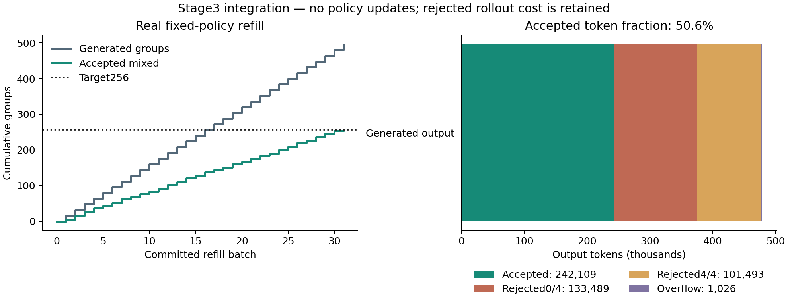

# Stage 3 — Dynamic Sampling 与真实 refill 集成

| 正式实测指标 | 数值 |
| --- | --- |
| generated group attempts / generated groups | 496 |
| valid groups | 496 |
| all-wrong / mixed / all-correct | 138 / 257 / 101 |
| accepted mixed / overflow eligible | 256 / 1 |
| invalid groups | 0 |
| completed trajectories | 1984 |
| sampling amplification | 1.937500× |
| attempt amplification | 1.937500× |
| generated output tokens | 478117 |
| accepted-group output tokens | 242109 |
| rejected-group output tokens | 234982 |
| overflow output tokens | 1026 |
| generation wall seconds | 1947.643869 |
| active GPU worker seconds | 2039.387755 |
| generation output tokens/s | 245.484818 |
| accepted rollout token fraction | 50.6380% |
| optimizer updates | 0 |

正式 run：`s3_formal_20260909T053101_d99393`。来源：[完整 summary](../../experiments/stage3/s3_formal_20260909T053101_d99393/summary.json)、[逐组摘要](../../experiments/stage3/groups.json)、[成本](../../experiments/stage3/cost_summary.json)、[验收 receipt](../../experiments/stage3/verification-final.json)。本阶段固定 Stage1 SFT policy，完成256个真实 mixed groups 的 sampler 集成；没有任何 policy optimization 或准确率提升实验。

## 1. 定义、有效性与奖励冻结

Stage2的1000×4 profiling发现53.1%的组具有可验证正确性差异。本阶段要验证新生成、奖励、过滤和补采样能否形成一个可恢复、可计量的真实循环。完整G4组中只有 `0 < sum(acc) < 4` 才取得未来训练窗口的资格，0000和1111均拒绝。决策函数仅接收binary acc；semantic、format、total_reward和长度的变化不能改变资格。

先判断validity：恰好4条完成的stop/length轨迹、4个唯一trajectory IDs、相同prompt/group/policy/config/reward版本，且acc为0或1。缺失、重复、跨题、跨policy和transport error单列invalid，不能归成all-wrong。所有16种binary pattern、奖励/长度扰动、invalid、cyclic stream、overflow、starvation和状态恢复有确定性单测。全仓库98项测试通过，包括真实发现的摘要写入回归测试。

继承 Qwen/Qwen3-8B revision `b968826d9c46dd6066d109eabc6255188de91218`，Stage1 final-budget r32/alpha64七投影adapter SHA `1601e97891e51940bd4b575d8811a77d8278cbeb296c044b7004e41da6d9ea64`。policy_version固定 `cdb99bc34f05c71a7ec6411c19e7091562e8f8b3277961ceb83d33e8393a9ff1`。G4、temperature0.6、top_p1、top_k−1、max_response1024不变；奖励仍为 `0.8acc + 0.15acc·sem + 0.05format`，BGE-M3 revision `5617a9f61b028005a4858fdac845db406aefb181`，reward manifest SHA `cc72be1c2348d20f58bf978d047b9b4a2f200d8c70c39f0d0d98506528bfb905`。原六个核心模块不改写。

## 2. Controller、stream 与上游关系

沿用[verl官方DAPO说明](https://verl.readthedocs.io/en/latest/algo/dapo.html#dynamic-sampling-with-group-filtering)的acc过滤/重复生成语义。本阶段复用冻结的vLLM、parser、BGE和hybrid reward，新增持久化控制器；没有执行包含actor更新的DAPO trainer，也没有引入overlong reward、clipping或token-loss变化。详见 [Stage3决策与计划](../implementation/STAGE3_PLAN.md)。

每批16题，engine max_num_seqs16，生成后完整计分并按stream顺序处理。正式target256；最大128批用于starvation保护，未达到目标就BLOCKED，不能无限循环或减预算。实际执行31批。达到256后同批额外mixed标overflow_eligible，成本完整保留，停止补采样。

candidate pool继承Stage2固定15000题，SHA `6fa3e114f47c51977d940ca01b4e0d6510a03a390fe1f1495fe5d0820bf41262`。全部题按seed42、domain `stage3:formal`、epoch和prompt_id的SHA确定顺序；遍历完会进入新epoch的完整排列。没有prompt黑名单或基于历史结果改变概率。prompt_id代表源题；group_id含run/policy/encounter，重复遭遇仍是新组。未来policy更新须开启新的policy window，旧版本轨迹不能混入。

生成唯一prompt 496，接受唯一prompt 256，最大曝光1；曝光直方图 `{'1': 496}`。结束epoch/cursor=0/496。正式题与Stage2 profiling重叠36题，与Stage3成功smoke重叠0题。重叠仅指题号：formal独立run、计数器和domain，所有回答均重新生成，未使用Stage2的531个旧mixed凑数。

## 3. Smoke、真实中断与失败保留

成功smoke `s3_smoke_20260909T052408_5114dc`：32题×4，实际mixed/accepted=13。第一批16组后保存checkpoint，外部SIGTERM终止拥有的worker进程组，观察旧进程退出、显存恢复15MiB，再启动新PID。新进程恢复同一run的accepted/generated、epoch/cursor、next encounters、dispositions、seed和token ledger；第二批从第17题开始，无重复group IDs。[Smoke验收](../../experiments/stage3/smoke_verification.json)包含raw重算和真实restart gate。

每批保留reservation、raw output/token IDs、BGE vectors/编码元数据、scored responses、commit及state_after。提交后重启以commit重放为准；raw已存但尚未计分可复用同一输出。若生成中断且raw尚未返回，成本不可知则保留FAILED，不静默重试补0。此次真实恢复测试发生在已提交批次边界；未宣称验证所有断电/文件系统故障位置，也未宣称跨进程随机生成逐token完全一致。

保留两个失败：`s3_smoke_20260909T051456_a53a8c`完成32组后摘要writer重复run_id导致TypeError，durable commit未丢失；`s3_smoke_20260909T052138_e6717b`因前一个失败worker残留显存，在任何generation请求前被vLLM空闲显存保护拒绝。修复摘要合并、显式engine_core.shutdown、异常后的owned-group清理和启动前显存门槛。成功smoke重新执行，不将失败run升级为PASS。失败raw/日志、恢复出的成本与system cases均纳入最终seal。

## 4. 正式分布与Stage2比较

| 正确数 | Stage2 profiling：1000组 | Stage3 generated valid | Stage3 accepted |
| --- | --- | --- | --- |
| 0/4 | 235 | 138 | 0 |
| 1/4 | 152 | 68 | 68 |
| 2/4 | 154 | 66 | 65 |
| 3/4 | 225 | 123 | 123 |
| 4/4 | 234 | 101 | 0 |

Stage3 observed P_mixed=51.8145%，Stage2为53.1%；Stage2一阶预估1/0.531=1.883239×，Stage3实测valid/accepted=1.937500×。两者分母并不完全相同：Stage3精确target的overflow计入generated而不计accepted；有限样本、独立prompt slice与顺序、批次布局也可能造成差异。本次invalid=0，故attempt amplification与valid amplification相同。不能将几个百分点差异解读为policy能力提升。

轨迹准确率49.0423%只描述这次训练池采样的SFT输出，不是held-out/test评估。valid=496=138+257+101；mixed=257=256+1 overflow；completed valid trajectories=1984=4×valid。所有被拒绝的完整回答与奖励仍保留。

## 5. Token成本与长度

| Disposition | output tokens | 均长 | P95 | P99 |
| --- | --- | --- | --- | --- |
| accepted | 242109 | 236.435 | 373.850 | 442.000 |
| rejected_all_wrong | 133489 | 241.828 | 379.450 | 446.940 |
| rejected_all_correct | 101493 | 251.220 | 353.850 | 405.700 |
| overflow_eligible | 1026 | 256.500 | 280.100 | 280.820 |
| invalid | 0 | N/A | N/A | N/A |

output总数478117，accepted token fraction=50.6380%。这是rollout token eligibility fraction，不是GPU利用率、MFU或occupancy。过滤发生在生成之后，被拒绝的234982 tokens已付出生成成本；不能声称这些token被节省。

prompt tokens同时记录共享prefill口径66501和4轨迹逻辑口径266004。policy identity controls另产生40输出tokens，不混入正式G4分布。generation wall=1947.644s，throughput=245.485 tokens/s；BGE计分=36.674s；active worker=2039.388s含模型加载/身份检查/评分，排除人工pause空档，并不等同GPU kernel busy time。正式NVML峰值32.606GiB。Stage2请求批次为4题，Stage3为16题，吞吐差异不能单独归因于过滤算法。原始run start/end和各进程日志保留用于其他wall口径。成功smoke与两个失败run的成本也在compute calibration分别保留，全部已返回rollout共543123输出tokens；失败worker占用与随后startup尝试有时间重叠，不把两者wall直接相加成GPU小时。

全体均长240.986，P95=372.000，P99=441.170，max=576.0；截断率0.0000%。length完成标志仍属于valid generation，无法解析答案时按冻结规则acc0，不额外添加超长惩罚。

## 6. Parser contrast 与多选切片

| mixed slice | 全部 mixed | accepted mixed |
| --- | --- | --- |
| mixed_parsed_wrong | 111 | 110 |
| mixed_unparseable_only | 78 | 78 |
| mixed_both | 68 | 68 |

全部mixed中包含parsed-wrong的组179；accepted中包含parsed-wrong的组178，unparseable-only=78/256=30.4688%。mixed_parsed_wrong表示只有可解析错误答案形成错误侧；mixed_both同时有parsed-wrong和unparseable。三者互斥，两个包含parsed-wrong的类别合并成mixed_with_parsed_wrong。Stage3全部mixed中unparseable-only为78/257=30.3502%。Stage2的153/531=28.8136% unparseable-only以全部mixed为分母，比较时需保持同一口径。

无法解析的response仍是acc0，包括 `[1,1,1,unparseable]` 的mixed。只做analysis slice，不改变资格。如果未来policy修复格式，这部分contrast可能减少，P_mixed和refill成本可能变化；本阶段未验证变化方向。strict format=87.3992%，unparseable=12.6008%，ambiguous=9.7782%；parse errors `{'unclosed_thinking': 54, 'invalid_thinking_structure': 194, 'illegal_or_empty_options': 2}`。

| Ground-truth answer cardinality | all-wrong | mixed | all-correct |
| --- | --- | --- | --- |
| 1 | 126 | 253 | 101 |
| 2 | 2 | 0 | 0 |
| 3 | 3 | 2 | 0 |
| 4 | 5 | 1 | 0 |
| 5 | 2 | 1 | 0 |

answer cardinality来自固定ground truth，多选属于稀少描述性子群。无difficulty/category标签、未按结果删题，不能据此断言某临床专科必然更难。

## 7. Correctness variance 与hybrid reward variance

all-wrong有62组correctness std=0而hybrid reward std>0；all-correct有83组。前者可能来自format，后者也可来自semantic差异。因此精确表述是过滤“没有可验证正确性差异的组”，不能笼统称去掉所有zero-advantage groups。本阶段仅保存population reward/correctness std，未计算真实GRPO-style advantage。

## 8. 完整轨迹阅读与policy frontier cases

Agent逐条阅读76条完整轨迹，覆盖accepted、两种reject、1/2/3正确、unparseable-only和多选。来源：[逐条review](../../experiments/stage3/manual_review.json)、[完整阅读材料](../../experiments/stage3/manual_review_packet.txt)、[自动case覆盖](../../experiments/stage3/case_coverage.json)。这是模型行为、parser与奖励的定性审读，不是医学专家审定。

### 3/4：可见字母正确但未闭合think

Group `s3_formal_20260909T053101_d99393:cdb99bc34f05:encounter:00000000`。四条可见最终字母都是E，其中9token回答未闭合think，冻结parser将其记为acc0；另三条结构完整，得到[0,1,1,1]。

这个组的contrast完全来自可解析性，不能把它解释为四次医学答案判断存在分歧；资格仍按合同接受，单列unparseable-only。

### 2/4：可解析答案分歧与正文结论冲突

Group `s3_formal_20260909T053101_d99393:cdb99bc34f05:encounter:00000001`。有机氟题得到[B,C,B,D]，acc=[1,0,1,0]。错误两条正文坚持选项外答案并质疑题目，最终却给C/D；D轨迹semantic约0.881但门控奖励仅0.05。

该组包含真正parsed-wrong对照，可作为未来训练资格示例；正确B轨迹的机制解释也未被acc单独验证，不作临床结论。

### 3/4：标签正确不能保证周数论证一致

Group `s3_formal_20260909T053101_d99393:cdb99bc34f05:encounter:00000015`。面部发育周数题最终[C,D,C,C]，标签C对应第8周。轨迹2正文反复论证第12周，却在最终选择C，因此仍获acc1。

这里同时有实际选项分歧和标签正确/解释不一致，说明verifiable reward只能验证定义中的最终答案；不能夸大为推理已被医学审定。

### 1/4：题干限定与错误极性

Group `s3_formal_20260909T053101_d99393:cdb99bc34f05:encounter:00000016`。解热镇痛题输出[AB,AB,C,A]，标签A。前两条未收窄仅用于的限定，第三条将问题反向理解，最后一条重新注意限定后收敛到A。

四条结构完整，1/4 mixed来自可解析最终集合差异；semantic均约0.88–0.90，不能用相似度替代正确性过滤。

### 2/4多选：缺项与完整集合

Group `s3_formal_20260909T053101_d99393:cdb99bc34f05:encounter:00000045`。甲亢题输出[BC,B,BCE,BCE]，标签BCE。前两条漏项，其中轨迹1正文写B/C但最终只输出B；后两条完整匹配。

严格集合匹配不提供部分正确奖励。多选错项、漏项和最终集合缩短形成了真实mixed；样本只能说明此行为存在，不估计总体医学难度。

自动case覆盖all-wrong/all-correct、1/2/3 mixed、unparseable-only、parsed-wrong、高semantic全错、hybrid-variance全对、长/短accepted、长rejected、多选全错/混合。未观察类别明确标NOT_OBSERVED，不补造case。自动极端样本不用于估计总体发生率。

## 9. 验收与下一阶段

READY_FOR_STAGE4 = YES。交接物为冻结SFT initialization、Stage2 pool/reward、Stage3纯sampler与bounded refill、resume receipt、完整raw成本账本和[readiness](../../experiments/stage3/readiness.json)。最终 `python scripts/verify_stage.py --stage 3` 从raw输出、tokenizer增量decode、保存的BGE vectors、parser/reward、stream和commit重新验证，不只信summary计数。

验收范围：前置Stage1/2 DONE与合同hash；16-pattern/adversarial/invalid测试；真实32×4 smoke；新generation反复refill至恰好256；同一policy及G4 lineage；全部拒绝/overflow保留；trajectory/counter/token守恒；真实终止与新进程恢复；>=50条阅读与cases；报告/面试/成本/readiness；失败run和最终bulk seal。最终状态在project_state与verifier receipt中记录。Stage4–6保持NOT_STARTED。

[Compute calibration](../../experiments/stage3/compute_calibration.json)用本阶段A、L、T给出Stage4 Dynamic初始生成投影：5000×A×4×L=9338222.656 output tokens，约10.567h generation。两条5000组baseline预算均未降低。实际policy会变化，actor/old-logprob、切换、validation和checkpoint成本仍须Stage4实测，不在此决定LR、mini-batch或clip。

## 10. 限制与可辩护结论

本阶段证明固定SFT下acc-only group filtering/refill及其计数/恢复可工作，测得256个eligible groups的真实生成成本。没有训练对照，因此没有准确率提升、update efficiency提升或rollout节省的因果结论。所有accepted仅取得未来update资格，本阶段尚无optimizer consumption。

继承的BGE语义分数对否定、剂量等细节辨别有限；高相似度不是医学正确性。缺参考解释取semantic0，少量非空占位参考仍按冻结版本编码，缺图题保持文本原样。benchmark label可能有噪声，格式合规不能代替事实审查。独立stream不保证与Stage2题号完全不重叠；所有重叠已量化。deterministic stream/seed保证恢复位置，不声称并行随机解码跨进程bitwise一致。

物理resume验收覆盖提交边界，不等同全部in-flight/断电故障已验证。未来每个policy window仍应记录P_all_wrong/P_mixed/P_all_correct、parsed-wrong/unparseable-only和amplification，持续检查policy barrier；不能永久删掉今天全错或全对的题。

# Interview Story

## 30秒

Stage2发现固定SFT约53%的G4组有正确性差异。我实现了基于acc的DAPO-style过滤与真实refill，并在新生成的496组中恰好接受256组，实测放大1.938倍，accepted只占输出token的50.6%。拒绝组也花了生成计算，所以我同时保存其原始回答和成本，并用真实终止/重启验证计数和stream恢复。本阶段只验sampler，没有训练或准确率提升主张。

## 2分钟

这个阶段的核心是为以后Vanilla GSPO和Dynamic GSPO建立可核验的采样差异。对同题4个回答先检查完整性，再只看acc是否同时包含0和1。全错和全对都缺少可验证正确性差异，但不代表hybrid reward完全一样：format与semantic仍可能使reward std非零，所以不能用total reward variance替代acc过滤，也不把reward std叫advantage。

工程上每批16题，固定adapter和奖励，在15000题的确定性循环stream上不断生成、打分、拒绝和refill，直到256个mixed。拒绝是当次group属性，不是永久题目黑名单；未来policy改变必须重新判断。同一批多出的eligible组单列overflow，raw与成本都保留。最终实测生成496组、478117输出tokens，放大1.938倍，说明过滤不能免费省生成计算。

一个容易忽略的细节是无法解析答案按acc0，所以correct与unparseable也会形成mixed。Stage2有28.8%的mixed只来自这种contrast，Stage3 accepted中该比例为30.5%；我把parsed-wrong、unparseable-only和both分开记录但不改资格。未来格式改善可能改变refill成本，这需要持续测量。

另一个收获是生命周期与证据写入也需要真实测试：smoke实际暴露摘要重复键和失败worker占显存的问题。失败日志和成本保留，修复后重新smoke，并在16组checkpoint后真正SIGTERM，再由新PID恢复原计数和下一批题。这些证据让Stage4可以检验训练方法，而不是把sampler的丢组、重计数或隐含成本当成算法效果。
